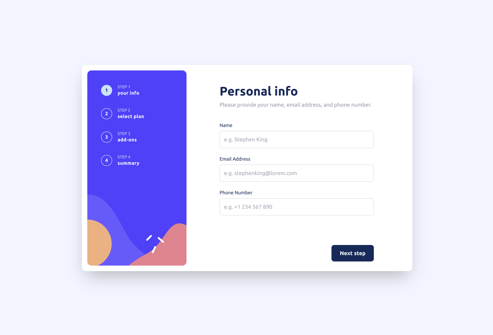

# Frontend Mentor - Multi-step form solution

This is a solution to the [Multi-step form challenge on Frontend Mentor](https://www.frontendmentor.io/challenges/multistep-form-YVAnSdqQBJ). Frontend Mentor challenges help you improve your coding skills by building realistic projects.

This project was generated with [Analog](https://analogjs.org), the fullstack meta-framework for Angular.

## Preview

[View on vercel](https://analog-js-multi-step-form.vercel.app/personal-info)

## Screenshot

## The challenge

Users should be able to:

- Complete each step of the sequence
- Go back to a previous step to update their selections
- See a summary of their selections on the final step and confirm their order
- View the optimal layout for the interface depending on their device's screen size
- See hover and focus states for all interactive elements on the page
- Receive form validation messages if:
  - A field has been missed
  - A step is submitted, but no selection has been made

## Setup

Run `pnpm install` to install the application dependencies.

## Development

Run `pnpm run dev` for a dev server. Navigate to `http://localhost:5173/`. The application automatically reloads if you change any of the source files.

## Build

Run `pnpm run build` to build the client/server project. The client build artifacts are located in the `dist/analog/public` directory. The server for the API build artifacts are located in the `dist/analog/server` directory.
